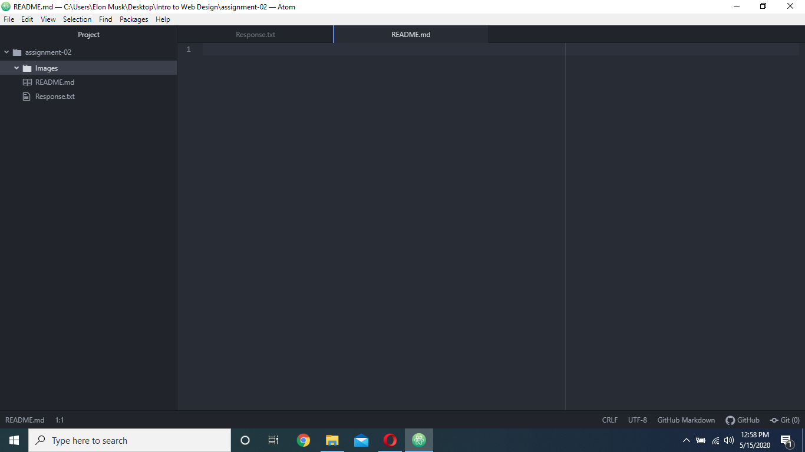

# Assignment 2
## Tristan Lilly

**This class is essential to the completion of my Media Arts degree.**
*I love the idea of coding and want to learn the basics and understand more about computers. Maybe understand hacking scenes in movie :o*

1. I have a better understanding of how the internet works and its distinction between "the web"
2. I have learned about different types of txt editors and what applications are used to create websites.
3. I hope to have a better understanding of website creation and the types of computer languages used in the process.

[common http errors](https://www.hongkiat.com/blog/common-http-errors/)
[relative link to responses](assignment-02/Responses.txt)

