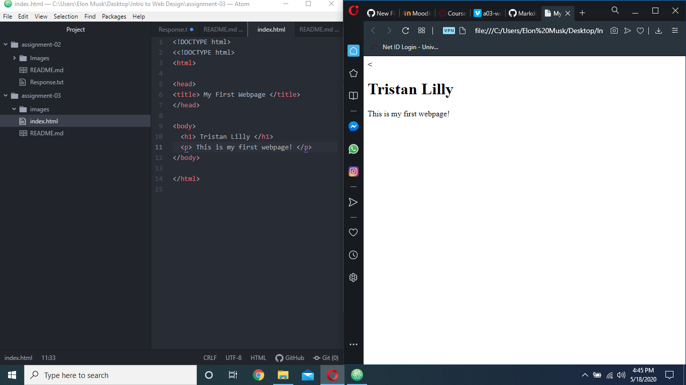

# Assignment 03 #

- Browsers I use: Opera, Google Chrome

- Web browsers function by using different types of render engines to read html and css files, and then turn those into a visual display as your user interface.

- Markup creates the building blocks for a webpage. everything else on that page will be based around what type of markup language was used. HTML (Hyper Text Markup Language) is the most common markup language.

